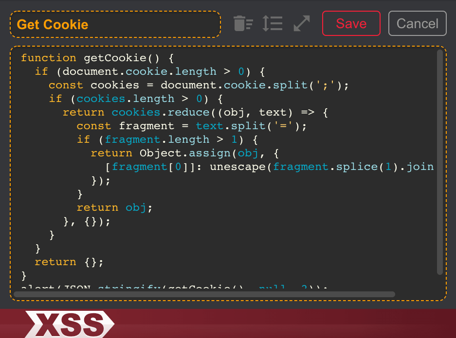
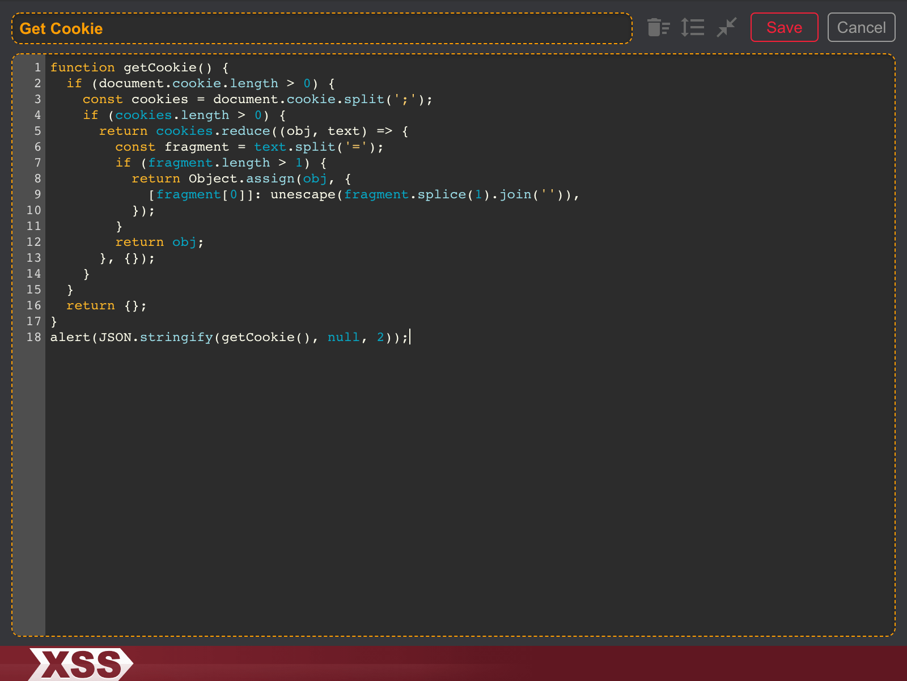
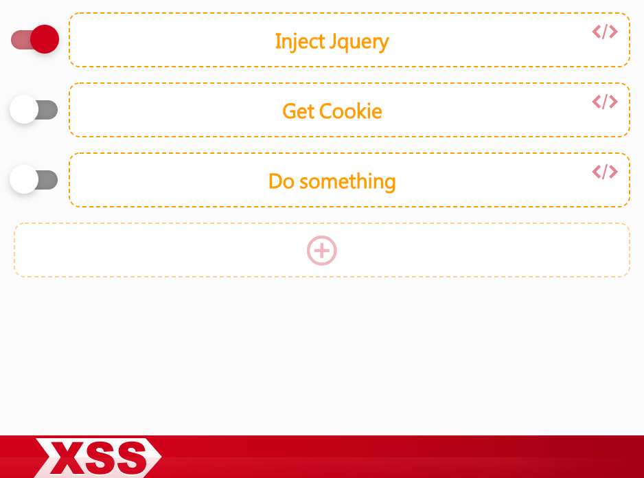
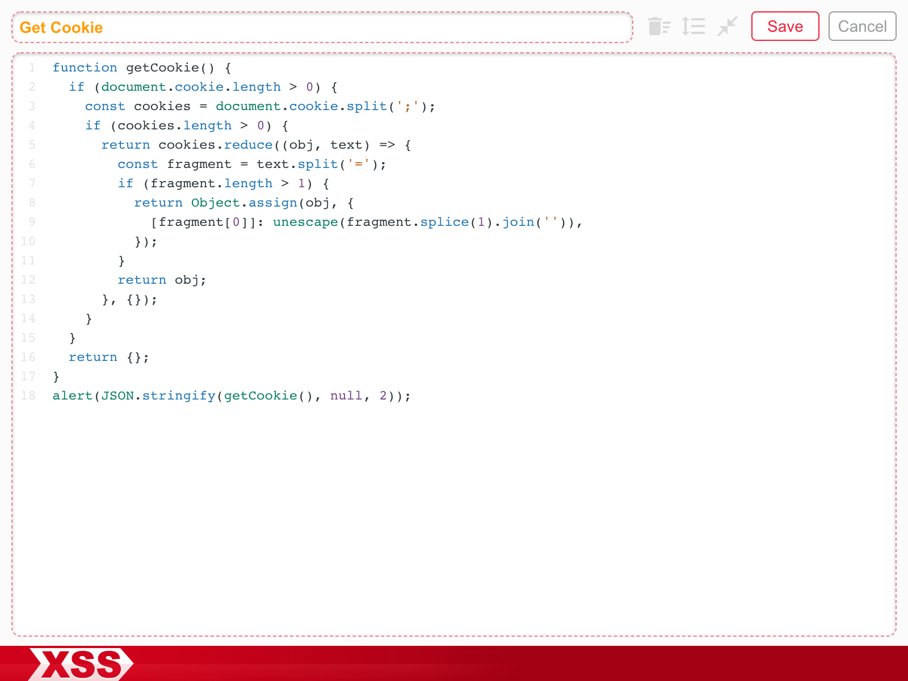

[](https://github.com/totofish/XSS/blob/master/LICENSE)
[](https://github.com/totofish/XSS/actions/workflows/main.yml)

## Introduction

此為 chrome extension 工具，可以注入自訂 `Script` 於當前網頁頁面中，例如將 Jquery 載入頁面來方便操作 DOM，或是讀取 cookie 資訊等任何其他想執行的 JS Script，用以方便作為測試或開發除錯等目的。

## Extension Install

至 [Chrome 線上應用程式商店](https://chrome.google.com/webstore/detail/xss/bebjbdbgpmgdlfehkibnmgmbkcniaeij) 安裝

## Export and Import Scripts

對外掛小圖示按右鍵選擇 `Export Scripts` 會將目前所有 Scripts 下載為 `scripts.json`，可讓別人將檔案 Drag 進 XSS 開啟的視窗介面 import 便能匯入 Scripts。

## Auto Execute

v1.1.0 版新增 Auto Execute 功能，切換前方 Auto Execute 狀態後，重整網頁時會在一開始便直接執行 scripts，方便執行一些需要一開始便執行的任務，例如使用 [Polly.js](https://netflix.github.io/pollyjs/) 來處理 mock api 的行為。不過須自己注意所攥寫的 script 不會造成無限重整頁面。

```js
// 例如這一段 script 啟用 Auto Execute 後會一直重整頁面
location.reload()
```

## Extension




## Dark Theme

外掛小圖示按右鍵選擇 `選項` 可取消 `Dark Theme` 改使用 `Light Theme`




## Tip

Extension 注入 script 時有使用 closure，因此變數不會污染到 window 上。如果需要取得全域層級的參數可以明確使用 window 或 this。

```js
console.log(this === window); // true
```
