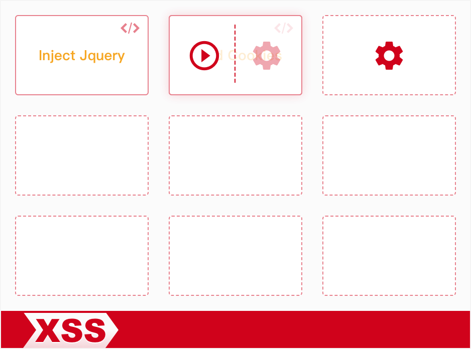
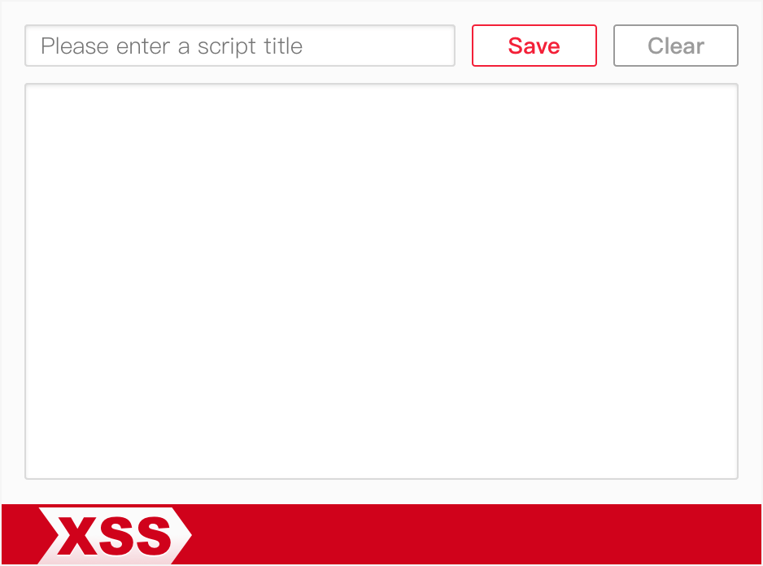
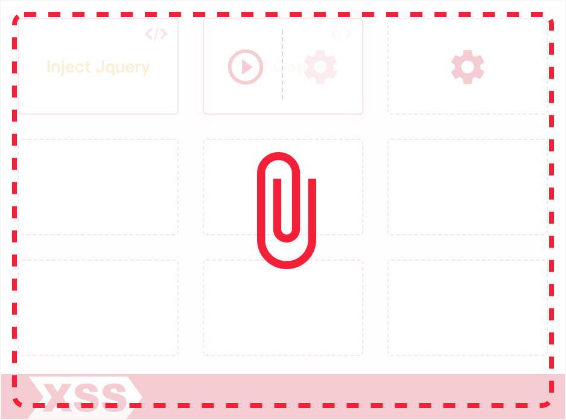

## Introduction

此為 chrome extension 工具，可以注入自訂 `Script` 於當前網頁頁面中，例如將 Jquery 載入頁面來方便操作 DOM，或是讀取 cookie 資訊等任何其他想執行的 JS Script，用以方便作為測試或開發除錯等目的。

## Extension Install

未上至 Chrome 線上應用程式商店，所以請下載 <a href="XSS.crx" target="_blank">XSS.crx</a> 後，開啟 `chrome://extensions/` 頁面後將 XSS.crx 拖進頁面中安裝。

## Export and Import Scripts

對外掛小圖示按右鍵選擇 `Export Scripts` 會將目前所有 Scripts 下載為 `scripts.json`，可讓別人將檔案 Drag 進 XSS 開啟的視窗介面 import 便能匯入 Ｓcripts。

## Extension

